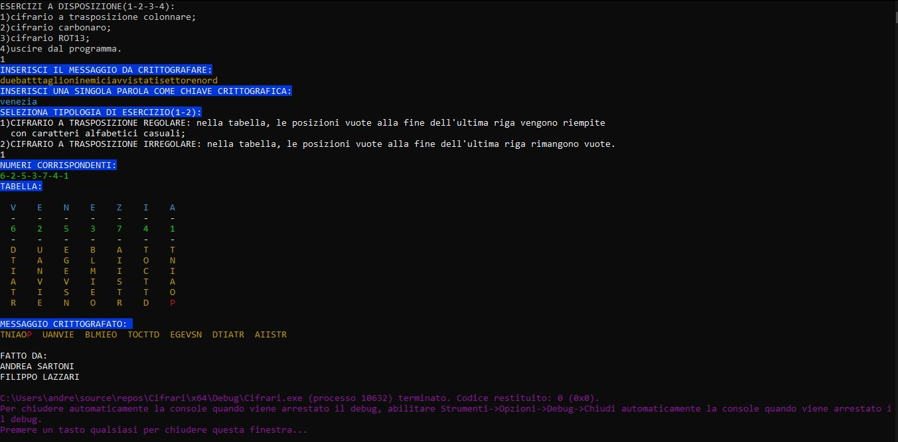
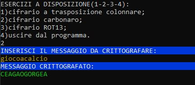
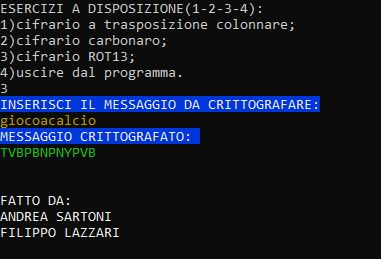
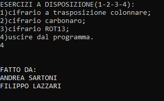

# Programma Cifrari Classici (in C)

[](https://github.com/andreee5/Progetto_cifrari_in_C/releases/latest)

Questo progetto è un'applicazione in linguaggio C che permette di cifrare e decifrare messaggi tramite tre metodi di crittografia classica, selezionabili da un semplice menù all'avvio del programma.

---

## ✍️ Autori

- Andrea Sartoni
- Filippo Lazzari

---

## 🔐 Descrizione del programma

All'avvio, l'utente può scegliere quale dei tre cifrari utilizzare:

---

### 1. 🧩 **Cifrario a trasposizione colonnare**
- Riordina i caratteri del messaggio basandosi su una parola chiave.
- Tipico esempio di cifratura per anagramma.

#### 📸 Esempio


---

### 2. 🗝️ **Cifrario carbonaro**
- Ispirato ai sistemi di cifratura usati dai carbonari, con sostituzione simbolica o lessicale.
- Ha valore storico oltre che didattico.

#### 📸 Esempio


---

### 3. 🔄 **Cifrario ROT13**
- Ogni lettera viene sostituita con quella a 13 posizioni dopo nell'alfabeto.
- È un metodo semplice ma efficace per oscurare messaggi.

#### 📸 Esempio


---

### 🛑 4. Uscita dal programma
- Se l’utente seleziona “4”, il programma termina in modo controllato mostrando un messaggio finale.

#### 📸 Esempio


---

## 🖥️ Come si usa

### 1. Compilazione

Se usi il terminale con `gcc`, posizionati nella cartella del progetto e digita:

```bash
gcc -o cifrari Progetto_cifrario_a_trasposizione_colonnare-cifrario_carbonaro-cifrario_ROT13.c
